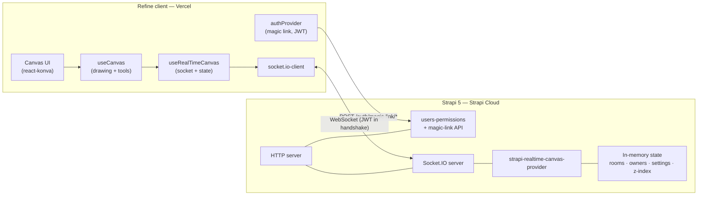
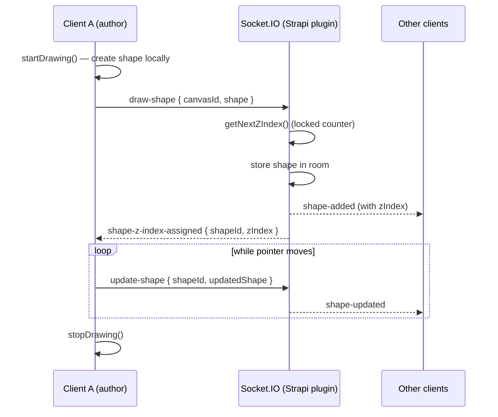
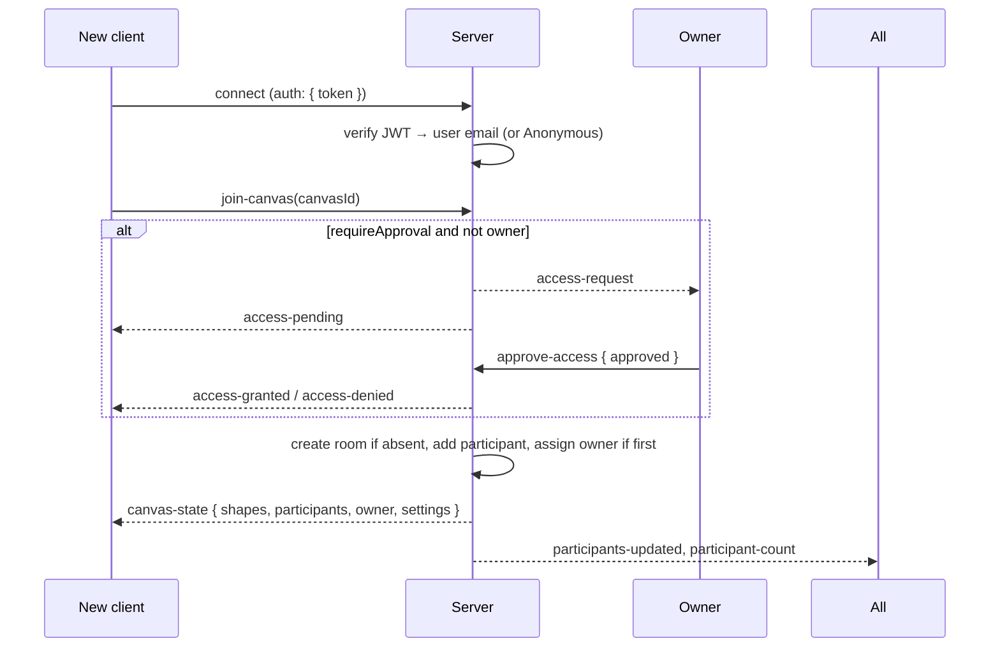

# Real-Time Collaborative Canvas — Backend

A multi-participant drawing canvas with sub-300 ms real-time synchronisation, built on a
custom **Real-Time Provider plugin for [Strapi](https://strapi.io)** (Socket.IO) and a
**[Refine](https://refine.dev) + React** client. Several users draw on one shared canvas
and see each other's strokes appear live.

This repository is the **backend** — a stock Strapi 5 app whose only custom code is the
real-time plugin. The **client lives in a separate repository** (linked below).

<p align="left">
  
  
  
  
  
  
  
</p>

> **Live demo**
> - App: https://strapi-real-time-canvas.vercel.app
> - Backend API (Strapi Cloud): https://realistic-dinosaur-9cb4e5ec36.strapiapp.com
>
> **Client repository:** [mnamvari/strapi-canvas-frontend](https://github.com/mnamvari/strapi-canvas-frontend)

---

## Table of contents

- [What it does](#what-it-does)
- [Architecture](#architecture)
- [Real-time event flow](#real-time-event-flow)
- [Event reference](#event-reference)
- [Tech stack](#tech-stack)
- [Repository layout](#repository-layout)
- [Getting started](#getting-started)
- [Configuration](#configuration)
- [How key mechanics work](#how-key-mechanics-work)
- [Deployment](#deployment)
- [Known limitations and trade-offs](#known-limitations-and-trade-offs)
- [License](#license)

---

## What it does

Built in two phases: first the shared real-time canvas, then identity and access features.

**Core collaboration**
- Shared global canvas; participants draw and edit in real time.
- Freehand pen, plus rectangle, circle, arrow, text and an eraser.
- Colour palette and adjustable stroke width.
- Designed for ~4 simultaneous participants on a single canvas.
- No persistence: canvas state lives in memory only and is discarded when the room empties.
- Reconnecting clients re-sync the full canvas state on rejoin.
- Export the canvas to PNG.

**Identity and access**
- Passwordless email authentication via magic links (Strapi users-permissions + JWT).
- The participant list shows each connected user's email.
- The first authenticated user to join becomes the **canvas owner**.
- Owner-only privacy controls: require approval to join, auto-clear after N minutes of inactivity, disable PNG download for non-owners.

---

## Architecture

Two deployable units talk over a single WebSocket connection. The backend is a stock
Strapi 5 app whose only custom code is the real-time plugin; the plugin attaches a
Socket.IO server to Strapi's HTTP server and keeps all canvas state in memory.



**Separation of concerns on the client**
- `useCanvas` owns drawing semantics: which tool is active, how a stroke is built point-by-point, shape geometry. It knows nothing about the network.
- `useRealTimeCanvas` owns the socket: connecting, emitting events, reducing inbound events into React state. It knows nothing about drawing.
- `Canvas.tsx` is presentation only and wires the two hooks to Konva.

---

## Real-time event flow

### Drawing a shape

A stroke is applied **optimistically** on the author's screen, then emitted. The server
assigns an authoritative z-index and fans the shape out to everyone else.



### Joining a canvas



---

## Event reference

| Event | Direction | Purpose |
|---|---|---|
| `join-canvas` | client → server | Join a canvas room by id (default `global-canvas`). |
| `canvas-state` | server → client | Full snapshot sent to a joining client. |
| `participants-updated` | server → clients | Updated participant list and owner. |
| `participant-count` | server → clients | Current number of participants. |
| `draw-shape` | client → server | Create a new shape. |
| `shape-added` | server → clients | Broadcast a created shape with its z-index. |
| `shape-z-index-assigned` | server → author | Return the authoritative z-index to the author. |
| `update-shape` | client → server | Update an in-progress/edited shape. |
| `shape-updated` | server → clients | Broadcast a shape update. |
| `clear-canvas` | client → server | Clear all shapes. |
| `canvas-cleared` | server → clients | Notify that the canvas was cleared. |
| `canvas-auto-cleared` | server → clients | Notify clear due to inactivity. |
| `update-canvas-settings` | client → server | Owner updates privacy settings. |
| `canvas-settings-updated` | server → clients | Broadcast new settings. |
| `access-request` / `access-pending` | server → owner / requester | Approval workflow. |
| `approve-access` | owner → server | Approve or deny a pending join. |
| `access-granted` / `access-denied` | server → requester | Approval outcome. |

---

## Tech stack

| Layer | Technology |
|---|---|
| Real-time transport | Socket.IO 4 over WebSocket |
| Backend | Strapi 5, custom plugin `strapi-realtime-canvas-provider`, SQLite (auth only) |
| Auth | Strapi users-permissions, JWT, custom magic-link API |
| Frontend framework | Refine 4 + React 18 + React Router 7 |
| Canvas rendering | Konva / react-konva |
| Styling | Tailwind CSS |
| Build / tooling | Vite, TypeScript |
| Hosting | Vercel (client), Strapi Cloud (backend) |

---

## Repository layout

This project spans **two repositories**:

- **Backend (this repo)** — the Strapi app and the real-time plugin.
- **Client** — the Refine + React app: [mnamvari/strapi-canvas-frontend](https://github.com/mnamvari/strapi-canvas-frontend).

```
strapi-canvas-backend/                 # this repo — Strapi 5 + real-time plugin
├── config/                            # server, database, middlewares, plugins
├── src/
│   └── api/magic-link/                # passwordless auth endpoints
└── packages/
    └── strapi-realtime-canvas-provider/
        ├── strapi-server.js           # Socket.IO server + all real-time logic
        └── services.js                # broadcast / state helpers
```

Client structure (in the separate repo):

```
strapi-canvas-frontend/                # Refine + React client
└── src/
    ├── hooks/useCanvas.ts             # drawing + tool state
    ├── hooks/useRealTimeCanvas.tsx    # socket connection + state
    ├── components/Canvas.tsx          # Konva stage + toolbar
    └── authProvider.ts                # magic-link auth
```

---

## Getting started

### Prerequisites
- Node.js ≥ 18 and ≤ 22
- npm (or yarn)

### Backend (this repo)

```bash
git clone https://github.com/mnamvari/strapi-canvas-backend
cd strapi-canvas-backend
npm install
cp .env.example .env        # then fill in the secrets below
npm run develop             # http://localhost:1337  (admin at /admin)
```

The plugin is enabled in `config/plugins` and boots the Socket.IO server automatically on
the same port as Strapi.

### Client (separate repo)

```bash
git clone https://github.com/mnamvari/strapi-canvas-frontend
cd strapi-canvas-frontend
npm install
npm run dev                 # http://localhost:5173
```

Point the client at your backend by editing `src/constants.ts`:

```ts
export const API_URL = "http://localhost:1337";
export const BACKEND_STRAPI_BASE_URL = "http://localhost:1337";
export const FRONTEND_URL = "http://localhost:5173";
export const TOKEN_KEY = "strapi-jwt-token";
```

---

## Configuration

### Backend environment (`.env`)

| Variable | Purpose |
|---|---|
| `HOST`, `PORT` | Strapi bind address (default `0.0.0.0:1337`). |
| `APP_KEYS`, `API_TOKEN_SALT`, `ADMIN_JWT_SECRET`, `TRANSFER_TOKEN_SALT`, `JWT_SECRET` | Strapi secrets. |
| `DATABASE_CLIENT` | `sqlite` by default; `mysql`/`postgres` supported. |
| `FRONTEND_URL` | Base URL used to build magic-link URLs. |
| `SMTP_HOST` … `SMTP_REPLY_TO` | Email provider for magic links. |
| `EMAIL_BYPASS` | Set `true` to log the magic link to the console instead of emailing — useful for local testing. |

### Magic-link testing without SMTP

When `NODE_ENV=development` or `EMAIL_BYPASS=true`, the `/auth/magic-link/send` endpoint
returns the link in its response and logs it, so you can authenticate without a working mail server.

---

## How key mechanics work

### Conflict resolution
Ordering is not significant — drawings are simply merged. The server is the single source
of truth: every shape is stored in the room and each gets a server-assigned, monotonically
increasing **z-index**. Clients render shapes sorted by z-index, so all participants
converge on the same stacking order regardless of network timing. There is no
operational-transform or locking on shape *content*; concurrent strokes coexist as
independent shapes.

### z-index assignment
`getNextZIndex` serialises index allocation per canvas using an async mutex around a
counter, returning a unique increasing value for each new shape. The author receives its
assigned index via `shape-z-index-assigned` and reconciles its optimistic local copy.

### Disconnection and reconnection
- `socket.io-client` is configured with automatic reconnection over WebSocket.
- Canvas state is held server-side for the lifetime of the room. While at least one
  participant remains, a reconnecting client rejoins and receives the full `canvas-state`,
  so nothing is lost.
- When the **last** participant leaves, the room (and its owner/settings) is deleted after
  a **30 s** grace period.
- The client shows a reconnection overlay with a 30 s countdown and a manual reload fallback.

### Auto-clear
A server interval (every 60 s) clears any canvas whose `autoClear` is enabled once it has
been inactive for `autoClearMinutes`, then broadcasts `canvas-cleared` / `canvas-auto-cleared`.

---

## Deployment

- **Client** → Vercel. `vercel.json` rewrites every route to `index.html` so React Router
  can handle deep links such as `/auth/verify?token=…`.
- **Backend** → Strapi Cloud (or any Node host that keeps the WebSocket server alive).
  Because real-time state is in memory, run a **single instance**; horizontal scaling would
  require a shared adapter (e.g. Redis) — see limitations.
- A `Dockerfile` and `docker-compose.yml` for the client static build live in the client repo.

---

## Known limitations and trade-offs

Listed deliberately, so the design choices and consciously deferred work are visible.

- **Single-instance only.** All canvas state is in memory. Multiple backend instances would
  not share rooms; a Socket.IO Redis adapter (or similar) is the standard fix.
- **No event validation or rate limiting on the socket.** Inbound payloads are trusted. For
  production, shapes should be schema-validated and high-frequency events throttled server-side.
- **Update payload growth.** Freehand strokes send the entire growing points array on every
  `update-shape`. Throttling and sending deltas would cut bandwidth on long strokes.
- **Eraser compositing.** The eraser is stored with `stroke: "#FFFFFF"` while the renderer
  toggles `destination-out` by comparing against lowercase `"#ffffff"`, so true erase
  compositing does not trigger and the eraser paints white. Fine on a white background, but
  it breaks over coloured shapes.
- **Touch input is disabled.** Touch handlers exist but are commented out in `Canvas.tsx`.
- **`CORS origin: "*"` with credentials** on the Socket.IO server should be tightened to known origins.
- **Dev magic-link leakage.** In development/bypass mode the token is returned in the HTTP
  response; that path must be unreachable in production.
- **No automated tests.** Coverage for the socket protocol and drawing reducers would be the
  first thing to add.

---

## Author

**Mohammad Sadegh Namvari** — Senior Full-Stack & Blockchain Engineer (.NET · React · TON/FunC)
[LinkedIn](https://linkedin.com/in/namvari) · [GitHub](https://github.com/mnamvari)

---

## License

MIT
